<div align="center">

# Kawã Lucio

### Desenvolvedor Full Stack & Mobile


[](https://github.com/KwL-21)


</div>

---

## Sobre mim

```javascript
const kawa = {
  role: "Desenvolvedor Full Stack & Mobile",
  location: "Rio de Janeiro, Brasil",

  backend: ["PHP", "APIs REST", "Integrações"],
  frontend: ["JavaScript", "HTML", "CSS", "Bootstrap"],
  mobile: ["React Native", "Expo"],
  databases: ["MySQL", "SQL"],
  tools: ["Git", "GitHub", "Composer", "Docker"],

  mindset: "Aprender, construir e evoluir continuamente"
};
```

Desenvolvo soluções web e mobile voltadas a necessidades reais, passando pela interface, regras de negócio, bancos de dados e integrações com serviços externos. Tenho experiência com manutenção e evolução de sistemas, automação de processos e geração de documentos e relatórios.

---

## Tech Stack

<div align="center">

### Principais tecnologias


### Ferramentas e ambiente


<br/><br/>


</div>

---

## Experiência prática

| Área | Tecnologias e atividades |
|:---|:---|
| **Aplicações web** | PHP, JavaScript, HTML, CSS, Bootstrap e organização de regras de negócio |
| **Aplicações mobile** | React Native, Expo, navegação, armazenamento local e notificações |
| **Dados e relatórios** | MySQL/SQL, planilhas, gráficos, geração e leitura de PDFs |
| **Integrações** | APIs REST, Firebase, LDAP, e-mail e serviços corporativos |
| **Automação** | QR codes, códigos de barras, rotinas agendadas e processamento de arquivos |
| **Ambiente e versionamento** | Composer, Docker, Git, GitHub e Laragon |

---

## Projetos em destaque

### Projetos públicos

| Projeto | Descrição | Stack |
|:---|:---|:---|
| [**Pousada Parnaioca**](https://github.com/KwL-21/Parnaioca) | Sistema web para apoiar processos de hotelaria e gerenciamento da pousada. | PHP, JavaScript, Bootstrap, SQL |
| [**Pousada**](https://github.com/KwL-21/Pousada) | Projeto web desenvolvido para apresentar e aplicar fundamentos de desenvolvimento. | HTML, CSS, JavaScript |
| [**Desafio**](https://github.com/KwL-21/desafio) | Projeto de estudo com aplicação prática de lógica e desenvolvimento web. | Desenvolvimento web |
| [**Thucas**](https://github.com/KwL-21/Thucas) | Projeto experimental criado durante minha evolução como desenvolvedor. | HTML, CSS, JavaScript |

### Projetos privados e organizacionais

Também atuo em sistemas corporativos, integrações, automações, relatórios e aplicações mobile. Por confidencialidade, detalhes dos repositórios privados não são expostos; as contribuições são contabilizadas anonimamente pelo calendário nativo do GitHub.

---

## GitHub Analytics

<div align="center">


<br/>






</div>

> Os cartões de estatísticas e tecnologias são gerados diariamente pelo GitHub Actions e armazenados neste repositório. Contribuições privadas e organizacionais são contabilizadas conforme as permissões concedidas ao token, sem expor o conteúdo dos repositórios.

---

## Atualmente

- 🔭 Evoluindo sistemas web e integrações corporativas
- 📱 Desenvolvendo experiências mobile com React Native e Expo
- 🧩 Aprimorando arquitetura, organização de código e APIs
- 🚀 Transformando processos manuais em soluções digitais

---

<div align="center">

### Vamos construir algo juntos?

[](https://github.com/KwL-21?tab=repositories)

<br/><br/>

**“Transformando problemas reais em soluções que funcionam.”**

</div>


